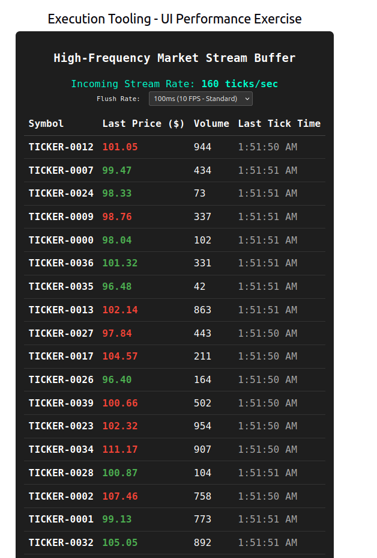

# Tool list: 

## High Frequency Stream market dashboard:

The dashboard emulates a high frequency data stream by generating a high amount of random values to test UI performance while emulating a market dashboard.

*TODO*: Add ag-grid virtualization so it can be expanded to thousands of tickers without freezing the browser.

